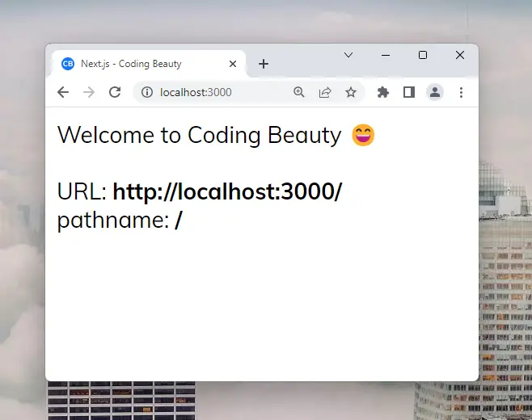
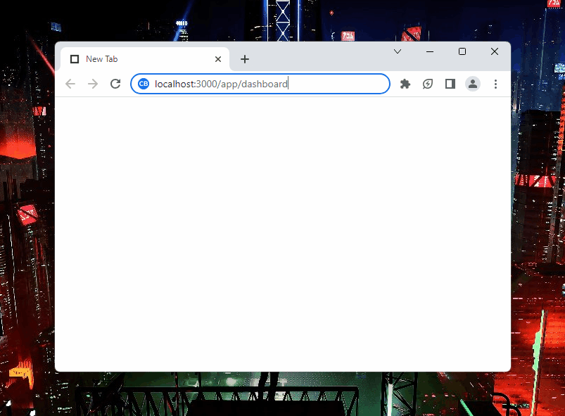

# nextjs-current-url

Quickly get the current URL or route in Next.js client & server environments ✨

## Usage

### Next.js client component

`nextjs-current-url` has a `useUrl` hook that quickly gives you the <a href="https://codingbeautydev.com/blog/nextjs-get-current-url" target="_blank">current URL</a> in a browser-rendered component.
It returns a `URL` object that let's you easily access specific parts of the URL, and works in both Pages and App Router.

Example:

```ts
import { useUrl } from 'nextjs-current-url';
import Head from 'next/head';

export default function Home() {
  // 👇 useUrl() returns `null` until hydration, so plan for that with `??`
  const { href: currentUrl, pathname } = useUrl() ?? {};

  return (
    <>
      <Head>
        <title>Next.js - Coding Beauty</title>
        <meta name="description" content="Next.js Tutorials by Coding Beauty" />
        <meta name="viewport" content="width=device-width, initial-scale=1" />
        <link rel="icon" href="/favicon.png" />
      </Head>
      <main>
        Welcome to Coding Beauty 😄
        <br />
        <br />
        URL: <b>{currentUrl}</b>
        <br />
        pathname: <b>{pathname}</b>
      </main>
    </>
  );
}
```

Result:


### getServerSideProps()

To use `nextjs-current-url` in `getServerSideProps`, call the `getUrl` function, passing the context object's `req` property.

Example:

```ts
import { NextPageContext } from 'next';
import Head from 'next/head';
import { getUrl } from 'nextjs-current-url/server';

export function getServerSideProps(context: NextPageContext) {
  const url = getUrl({ req: context.req });
  return {
    props: {
      url: url.href,
    },
  };
}

export default function Home({ url }: { url: string }) {
  const urlObj = new URL(url);
  const { pathname } = urlObj;

  return (
    <>
      <Head>
        <title>Next.js - Coding Beauty</title>
        <meta name="description" content="Generated by create next app" />
        <meta name="viewport" content="width=device-width, initial-scale=1" />
        <link rel="icon" href="/favicon.png" />
      </Head>
      <main>
        Welcome to Coding Beauty 😃
        <br />
        <br />
        URL: <b>{url}</b>
        <br />
        Route: <b>{pathname}</b>
      </main>
    </>
  );
}
```

Result:


### Next.js middleware

`next-js-current-url` also works in Next.js middleware files.
Call `getUrl` and pass the `NextRequest` object in the middleware function.

`src/middleware.ts`

```ts
import { NextResponse } from 'next/server';
import type { NextRequest } from 'next/server';
import { getUrl } from 'nextjs-current-url/server';
import { getSession } from '@/lib/session';

export async function middleware(request: NextRequest) {
  const { href, orgin } = getUrl({ req: request });
  const session = await getSession(request);
  if (!href.startsWith('/signin') && !session.user) {
    const signinUrl = new URL('/signin', origin);
    signinUrl.searchParams.set('continue', href);
    return NextResponse.redirect(signinUrl);
  }
}

export const config = {
  matcher: '/app/:path*',
};
```


